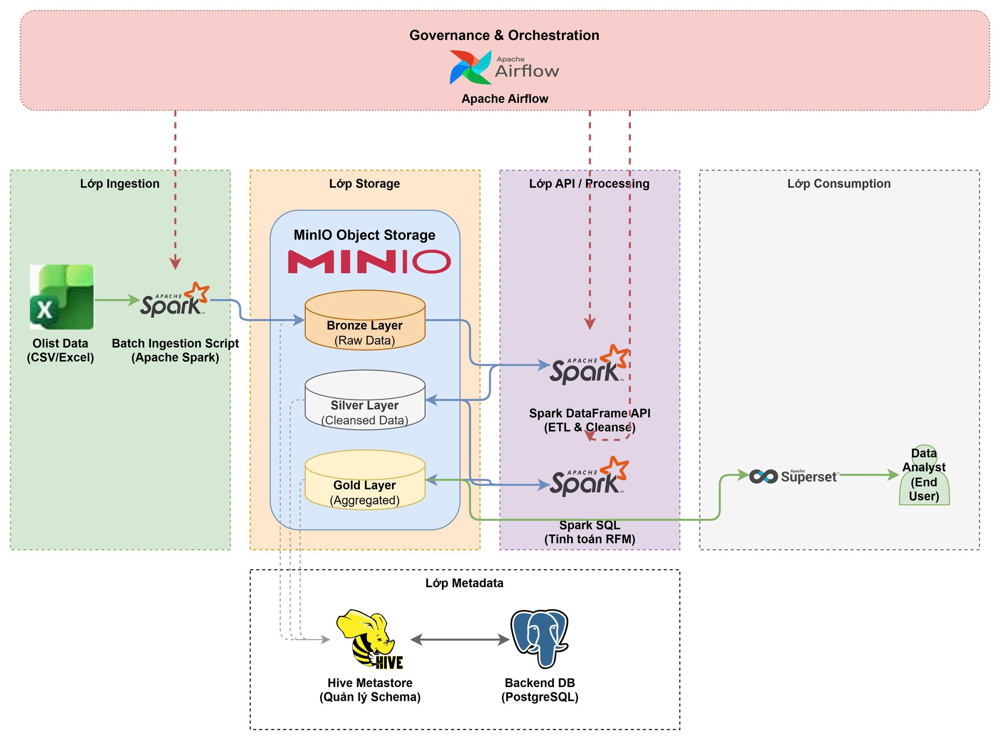

# 🛒 Olist E-Commerce Data Lakehouse


> **Academic Project - Big Data Analysis Course**  
> **Institution:** Ho Chi Minh City University of Technology and Engineering (HCM-UTE)  
> **Group:** 22 

## 📑 Table of Contents
- [Project Overview](#-project-overview)
- [System Architecture](#-system-architecture)
- [Medallion Data Pipeline](#-medallion-data-pipeline)
- [Tech Stack](#-tech-stack)
- [Prerequisites & Setup](#-prerequisites--setup)
- [Project Structure](#-project-structure)
- [Team Members & Contributions](#-team-members--contributions)

## 📖 Project Overview
This project focuses on building a complete, end-to-end **Data Lakehouse** pipeline to process, manage, and analyze massive volumes of e-commerce data. Utilizing the [Brazilian E-Commerce Public Dataset by Olist](https://www.kaggle.com/datasets/olistbr/brazilian-ecommerce) from Kaggle, the system is designed to extract actionable business insights such as **RFM (Recency, Frequency, Monetary) Customer Segmentation**, delivery KPIs, and sales trends.

The project strictly adheres to the modern 5-layer Data Lakehouse architecture, leveraging distributed processing engines (Apache Spark) and ACID-compliant storage (Delta Lake) over legacy big data tools.

## 🏗️ System Architecture
The system architecture implements the core five layers of a Data Lakehouse:

1. **Ingestion Layer:** Batch processing of raw CSV files.
2. **Storage Layer:** Object storage via **MinIO** (S3-compatible) utilizing the **Delta Lake** format to guarantee ACID properties.
3. **Metadata Layer:** Centralized Data Catalog powered by **Hive Metastore** (backed by **PostgreSQL**) to define schema and manage data access.
4. **Processing / API Layer:** Data transformations, joins, and aggregations executed via **Apache Spark** (DataFrame API & Spark SQL).
5. **Consumption Layer:** Interactive BI dashboards built with **Apache Superset**.
6. **Orchestration:** End-to-end pipeline automation scheduled via **Apache Airflow**.




## 🏅 Medallion Data Pipeline

The data lifecycle is managed using the Medallion Architecture:

### 🥉 Bronze Layer (Raw Data)
Ingests all core Olist CSV tables and saves them in Delta format without schema enforcement.

Expected raw files in `data/raw/olist/`:
- `olist_orders_dataset.csv`
- `olist_order_items_dataset.csv`
- `olist_products_dataset.csv`
- `olist_customers_dataset.csv`
- `olist_order_reviews_dataset.csv`
- `olist_sellers_dataset.csv`
- `olist_geolocation_dataset.csv`
- `olist_order_payments_dataset.csv`
- `product_category_name_translation.csv`

### 🥈 Silver Layer (Cleansed & Conformed)
Filters out canceled orders, handles missing values, casts data types (e.g., Timestamps), and performs distributed joins across multiple tables (orders, customers, products, order_items) to create denormalized factual tables.

### 🥇 Gold Layer (Aggregated Analytics)
Applies advanced Spark SQL window functions and aggregations to generate business-ready tables:

- **gold_rfm_segments**: Customer segmentation based on RFM scores.
- **gold_delivery_kpis**: Logistics performance tracking.
- **gold_sales_trends**: Revenue generation over time.

## 🛠️ Tech Stack
| Component | Technology | Description |
| :--- | :--- | :--- |
| Storage Engine | MinIO | S3-Compatible object storage for local environments. |
| Table Format | Delta Lake | Brings ACID transactions to Apache Spark and big data workloads. |
| Processing Engine| PySpark & Spark SQL | In-memory distributed computing framework. |
| Data Catalog | Hive Metastore | Manages metadata schemas. |
| RDBMS (Backend) | PostgreSQL | Acts as the backing database for Hive Metastore. |
| Orchestration | Apache Airflow | Automates data pipelines (DAGs). |
| Visualization | Apache Superset | Open-source modern data exploration and BI platform. |
| Infrastructure | Docker Compose | Containerization for reproducible environments. |
## 🚀 Prerequisites & Setup
### 1. Prerequisites

Ensure you have the following installed on your machine:
- Docker & Docker Compose
- Git

### 2. Installation

Clone the repository to your local machine:
```bash
git clone https://github.com/your-repo/olist-data-lakehouse.git
cd olist-data-lakehouse
```

### 3. Spin up the Infrastructure

Start the entire Data Lakehouse stack using Docker Compose:

```bash
docker-compose up -d
```

Wait approximately 2-3 minutes for all containers (Spark, MinIO, Hive, PostgreSQL, Airflow, Superset) to initialize.

### 4. Service Endpoints

Once the containers are running, access the services via:

MinIO Console: http://localhost:9001 (Default: minioadmin / minioadmin)

Airflow Web UI: http://localhost:8080 (Default: airflow / airflow)

Superset: http://localhost:8088 (Default: admin / admin)

Spark UI: http://localhost:4040 (Available during job execution)

### 5. Prepare Raw Dataset

Download and extract the full Olist dataset from Kaggle, then place all 9 CSV files in:

```text
data/raw/olist/
```

### 6. Running Bronze Ingestion

Run the bronze job manually from the project root:

```bash
python jobs/01_ingest_bronze.py
```

Or run it from the notebook container:

```bash
docker exec -it olist-pyspark-notebook python /home/jovyan/work/jobs/01_ingest_bronze.py
```

## 📁 Project Structure
```text
.
├── dags/                       # Apache Airflow DAGs
│   └── olist_pipeline_dag.py
├── data/                       # Local volume mapping for raw CSVs (Ignored by Git)
├── jobs/                       # PySpark scripts for ETL
│   ├── 01_ingest_bronze.py
│   ├── 02_process_silver.py
│   └── 03_analytics_gold.py
├── notebooks/                  # Jupyter notebooks for Data Exploration and PoC
│   └── 00_spike_test.ipynb
├── src/                        # Shared utility modules for PySpark jobs
│   ├── __init__.py
│   ├── spark_session.py        # Centralized SparkSession builder with MinIO config
│   └── config.py               # Constants, table names, S3 paths
├── conf/                       # Configuration files (Spark defaults, Hive-site)
│   └── spark-defaults.conf
├── docker-compose.yml          # Infrastructure setup
├── requirements.txt            # Python dependencies
├── .gitignore                  # Exclude raw data and logs
└── README.md                   # Project documentation
```

## 👥 Team Members & Contributions
| Name | Student ID | Primary Role | Key Responsibilities |
| :--- | :--- | :--- | :--- |
| Đinh Trọng Đức Anh | 22110096 | Infrastructure & Bronze Layer | Docker setup, MinIO configuration, Data Ingestion (CSV to Delta). |
| Lê Văn Lộc | 22110178 | Silver Layer (ETL) | Big Data transformations, data cleansing, distributed joins using PySpark. |
| Nguyễn An Khang | 22110190 | Gold Layer (Analytics) | Advanced Spark SQL, analytical functions, RFM computation, KPIs. |
| Vũ Kiều Thúy Vân | 22110266 | Governance & Consumption | Hive Metastore cataloging, Airflow Orchestration, Superset Dashboards. |

Developed for the Big Data Analysis Course - Spring Semester 2026-2027.
