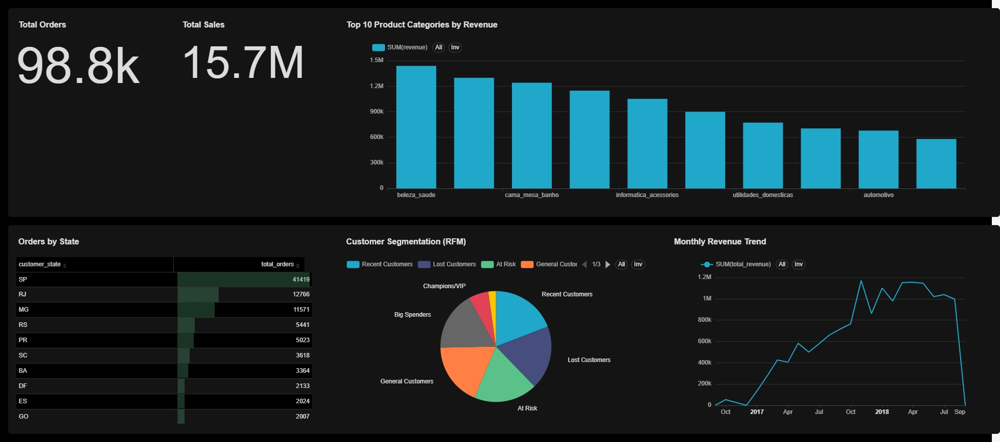

# 🛒 Olist E-Commerce Data Lakehouse

This project builds an end-to-end Data Lakehouse on a local Dockerized infrastructure to ingest, transform, and analyze the Brazilian E-Commerce public dataset by Olist. The architecture is designed similarly to enterprise cloud data platforms but runs exclusively on local containers and a Python virtual environment. It provisions automated ETL workflows from raw CSV ingestion through to business-ready Gold layer Data Marts.

## 🎯 Project Goals & Features

1. **Modern Data Architecture**: Implements the Medallion Architecture (Bronze, Silver, Gold).
2. **ACID Transactions**: Uses Delta Lake for robust data versioning, time travel, and upserts.
3. **Data Orchestration**: Apache Airflow manages and monitors daily batch pipelines.
4. **Data Cataloging**: Hive Metastore backed by PostgreSQL tracks Delta tables for unified access.
5. **Interactive Analytics**: Apache Superset and Spark Thrift Server enable direct BI dashboards querying the Lakehouse.
6. **Local-First Development**: Uses a unified `docker-compose.yml` for infrastructure and `venv` bridging to VS Code for agile machine-learning and scripting, minimizing heavy container bloat.

## 🏗️ System Architecture

### 1. Data Processing Engine
- **Apache Spark (PySpark)** handles distributed data transformations.
- **Delta Lake** provides the storage format (Parquet + transaction log) on top of raw storage.

### 2. Storage & Metadata
- **MinIO (S3-Compatible)**: Object storage acting as the underlying data lake (landing zone, bronze, silver, gold buckets).
- **PostgreSQL**: Stores metadata for both Apache Airflow and the Hive Metastore.
- **Hive Metastore**: Catalogs the Delta tables so they can be queried via SQL interfaces.

### 3. Orchestration & BI
- **Apache Airflow**: Orchestrates the multi-stage Spark jobs (`jobs/`).
- **Spark Thrift Server**: Exposes the Hive Metastore + Delta tables via a JDBC endpoint for SQL clients.
- **Apache Superset**: Connects to the Thrift Server to visualize Gold metrics (RFM segmentation, sales dashboards, etc.).

## 🔄 The Medallion Pipeline (ETL/ELT)

The pipeline is managed by Airflow (`dags/olist_lakehouse_dag.py`):
1. **Raw to Bronze (`01_ingest_bronze.py`)**: Reads the raw CSVs from MinIO, infers schemas, and writes them back as Delta tables to the `bronze` bucket.
2. **Metadata Registration (`register_tables.py`)**: Uses a Hive script to register the new Bronze tables into the Hive Metastore (`CREATE TABLE ... USING DELTA LOCATION ...`).
3. **Bronze to Silver (`02_process_silver.py`)**: Cleanses tables (filters out nulls, casts timestamps, removes duplicates) and writes to `silver`.
4. **Silver to Gold (`03_analytics_gold.py`)**: Performs business-level aggregations (e.g., calculating RFM - Recency, Frequency, Monetary value metrics per customer) and writes to `gold/rfm_segments`.

*(All table schemas and validation queries are managed automatically).*

---

### **Looking to setup or run this project on your machine?**
Please refer to the comprehensive [**Development & Setup Guide ➔**](DEVELOPMENT.md) for full installation instructions, dependency management, and running the pipeline.

